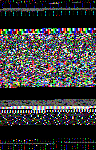
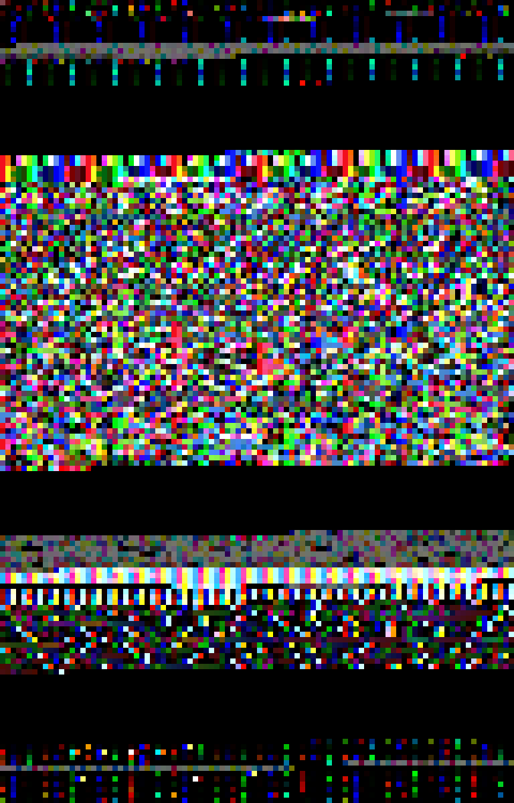
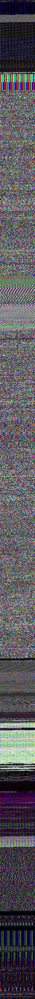
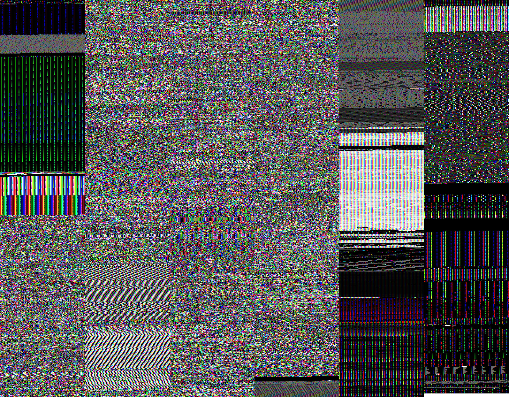

__**Warning**: The images in this README may be painful to view; they have been spoilered for safety. Open them at your own risk.__

# imageifier

Converts arbitrary binary data to images with optional
columnization and integer scaling for easier viewing.

Useful for visualizing the structure of binaries.

## How does it work?

It 'slices' a binary into slices of a given size, by default 96x1 in rgb24
(representing (96 × 1) px x 3 bytes/px = 288 bytes per slice) then glues the
slices vertically together to make a single (possibly very long!) image
out of it.

This approach allows small binaries to be visualized, as binaries only need
to have a minimum size of one slice to produce an image instead of full frames.

## Usage Scenario 1: tiny binary


```console
$ imageifier /usr/bin/true
```

The resulting image is too small to be legible.

<details>
  <summary>imageified /usr/bin/true</summary>



</details>


Use the `-e`/`--scale` option to do integer scaling. Let's say it should need 8x scaling.

```console
$ imageifier /usr/bin/true -e 8
```

<details>
  <summary>imageified /usr/bin/true, larger</summary>



</details>

Perfect!

## Usage Scenario 2: larger binary

```console
$ imageifier /usr/bin/xterm
```

<details>
  <summary>imageified /usr/bin/xterm</summary>



</details>


Not only is the image too small to be legible, it's also very tall.
Let's fix that with `-c`/`--columns` and `-e`.

```
$ imageifier /usr/bin/xterm -c 8 -e 4
```

<details>
  <summary>imageified /usr/bin/xterm, larger and spread across columns</summary>



</details>

Much better.

## Usage Scenario 3: huge binary

You might want to imageify a huge binary (5+ MB). In this case, you may want
to consider increasing the height of an individual slice to make it run faster.

```
$ imageifier /usr/lib64/libkritaui.so.18.0.0 -c 24 -s 96x96
```

<details>
  <summary>imageified /usr/lib64/libkritaui.so.18.0.0</summary>


</details>

